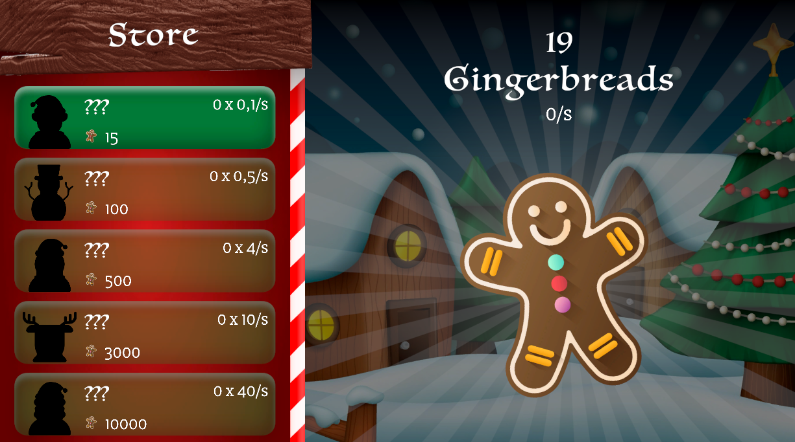

# Gingerbread Clicker Game (Unity 2D)

A cozy, Christmas-themed idle clicker game built with Unity. This project was developed to practice UI architecture, object-oriented programming (OOP) in C#, and code optimization for WebGL deployment.

## 🔗 Project Links
* **Playable WebGL Demo (Itch.io):** https://lyutyanytsya.itch.io/gingerbread-clicker

## 🛠️ Technical Implementation & Features
* **UI & Architecture:** Implemented a modular upgrade shop with scrollable lists and dynamic item scaling using component-based logic.
* **Component Control:** Created modular C# scripts such as `GameManager` for state and economy tracking, `StoreUpgrade` for handling item values, and `RotateAround` for visual UI juice.
* **Text Formatting:** Integrated TextMeshPro for sharp, dynamic score updates and custom font configurations.

